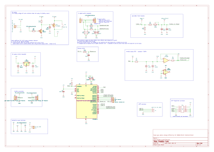
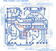
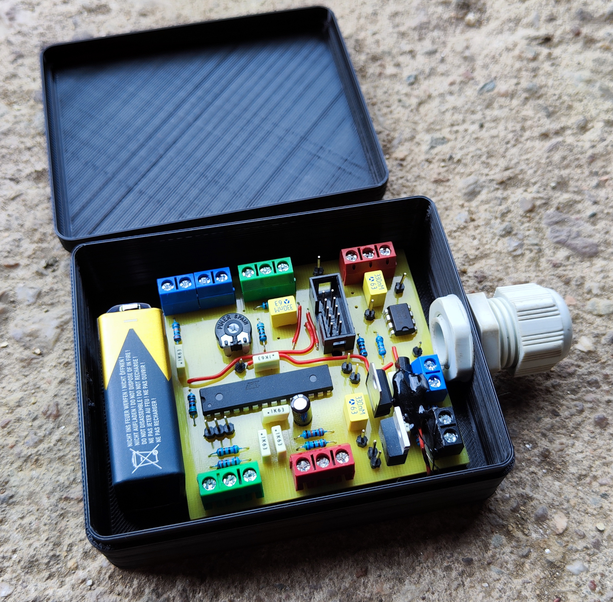
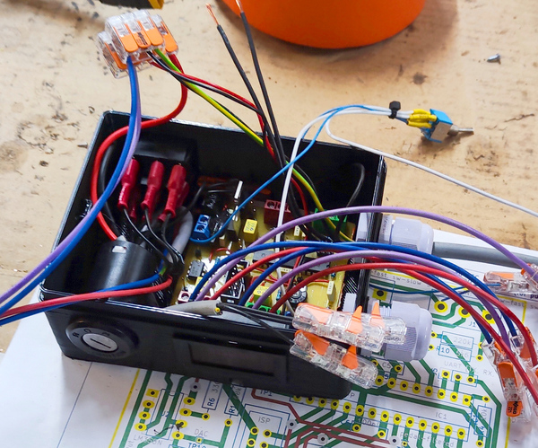
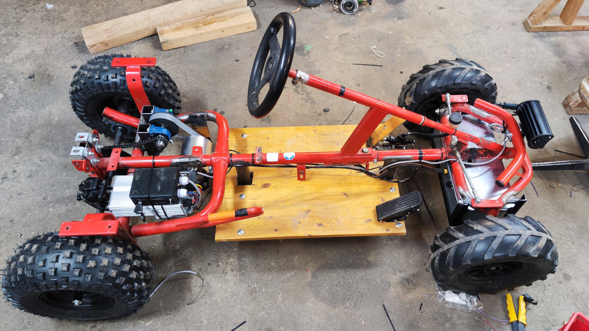
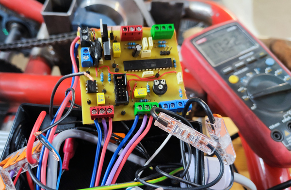
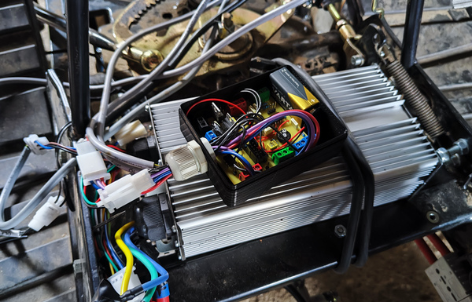

# Throttle Tune – Throttle Adapter for BLDC Motor Controllers

A microcontroller-based board with a PWM-based analog output (RC filter + buffer) to emulate a DAC.
The goal is to improve throttle response and add configurable driving modes to cheap BLDC motor controllers (e.g. 3000 W BLDC "go-kart kit" controllers).  

Currently it is used in the [electric Kettcar conversion](https://pfusch.zone/electric-kettcar.html) with a 3000 W BLDC drive, this board fixes the controller’s unusable throttle mapping and makes the vehicle smooth and controllable adding a lot of flexibility.

---

## Problem

Cheap BLDC controllers (such as KT-style 3000 W kits) have several issues:
- No configuration options at all
- Speed levels provided by the controller are usually defined poorly
- Only ~2 cm (~60 %) of gas pedal travel is actually used
- Jerky, hard-to-control acceleration (tiny pedal movements cause extreme changes in power - positive feedback when accelerating thus pressing the pedal more makes this even worse)

Using only the original setup makes smooth low-speed driving or child-friendly operation nearly impossible

---

## Solution

The **Throttle Tune** board sits between the analog throttle pedal (or handle) and the motor controller.  
It rescales, filters, and manipulates the signal (fading, modes...) while adding safety and convenience features.

---

## Features

### Firmware
- **Throttle remap**: use full pedal range (configure in/out ranges)
- **Ramp-up / fade**: prevents stuttering, smoother control (configurable max rate of change)
- **Speed modes**: 3 levels + hidden "Sport" mode (highly configurable - several parameters on per-mode-basis)
- **Reverse scaling**: reduced throttle in reverse
- **Buzzer alerts**: startup-, reverse-, mode switch beeps

### Hardware
- ATmega8 microcontroller
- Custom DAC output (0–5 V) to motor controller (implementation: PWM output -> lowpass -> buffer)
- CNC-milled single-sided PCB
- Through-hole components (easy to build/repair)
- 3D-printed enclosure
- Inputs: Hall pedal, reverse switch, speed selector
- Outputs: DAC to controller, buzzer

---

## Hardware

### Schematic
[pcb_throttle-tune/export/schematic.pdf](pcb_throttle-tune/export/schematic.pdf)  

### Layout

### PCB Photo

### Control Box
  

*Open box during wiring - custom PCB, key switch, battery indicator, UI switches*

---

## Example Applications

### Electric Kettcar
Documentation: [pfusch.zone/electric-kettcar](https://pfusch.zone/electric-kettcar.html)

*Wiring of PCB between pedal and controller (right) and the finished vehicle (left).*

---

### Electric Lawn Tractor (temporary use-case)
Documentation: [pfusch.zone/electric-lawn-tractor](http://localhost:4000/electric-lawn-tractor.html)

*Throttle Tune board inside in box on top of the motor controller, battery powered (earlier project - initial but temporary use).*

---

## Repository Content
- `pcb_throttle-tune/` – KiCad project, schematic, layout exports
- `fw_throttle-tune/` – AVR firmware (ATmega8)
- `doc/images` – photos of the build and control box

---

## Status
- **v2.0-kettcar** – production firmware tested and flashed before shipping to the Kettcar build.  
- PCB currently in use, proven in daily operation.  

---

## TODO (future hardware rev)
- Add TVS diode  
- Add buzzer footprint (currently wired to spare pin and implemented in firmware, but not documented in pcb design)  
- Drop unused terminals (see notes design)
- Add reverse polarity protection
- Add onboard buck converter to be used with e.g. 72V directly not requiring external converter
