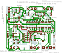
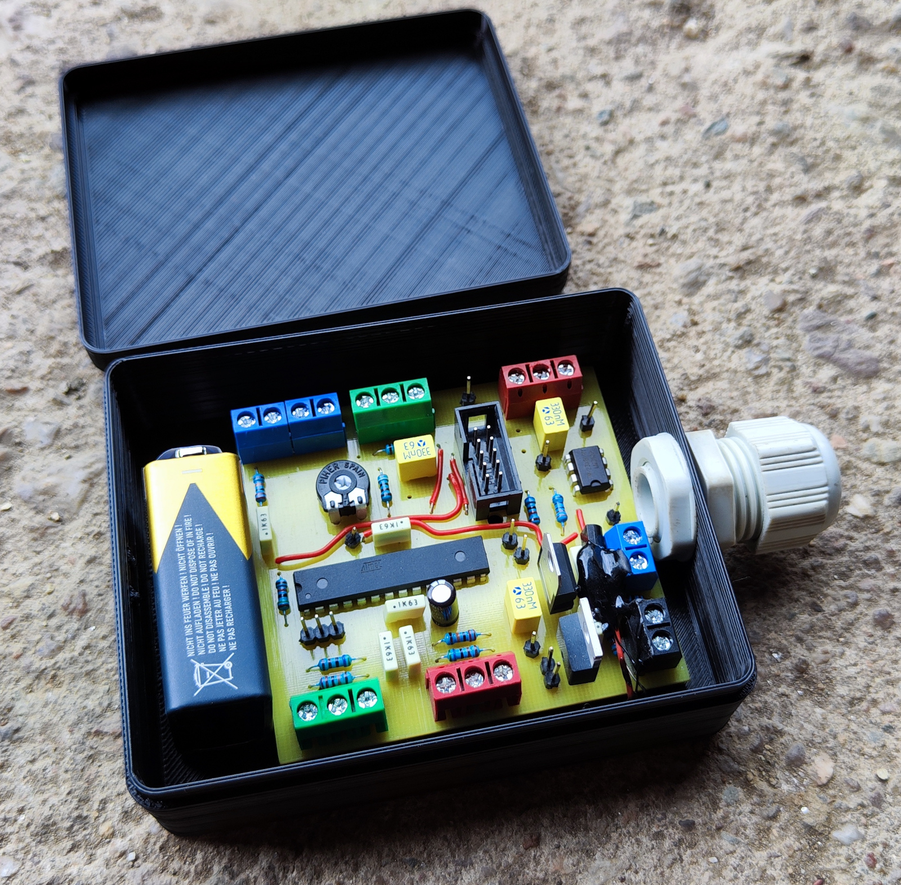

Pcb for manipulating the voltage of an analog gas pedal before passing it to the motor controller, using a microcontroller with a custom DAC.

# Issue
When using cheap 3000W bldc motorcontrollers (e.g. KT) i had the following problems:
- no way to configure anything
- only ~2cm of gas pedal travel is used
- impossible to drive since very small pedal movements (e.g. shakes) result in extreme acceleration.

# Features of this pcb
- make use of full range of pedal
- 3 speed levels: full pedal range for e.g. outputting 5% controller throttle only
- scale differently in reverse
- ramp up / down

# Schematic
[throttle-tune/pcb_throttle-tune/export/schematic.pdf](pcb_throttle-tune/export/schematic.pdf)

# Layout

# Photo
